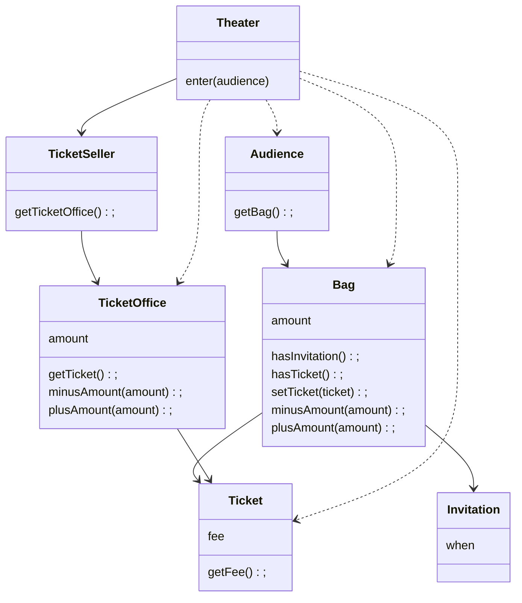
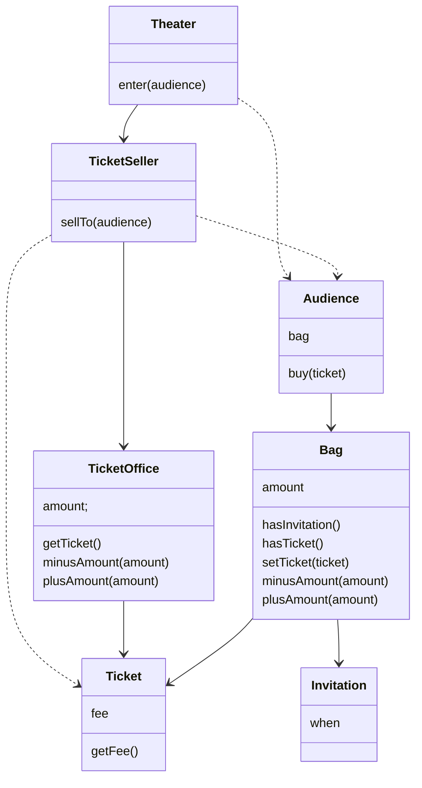

## [객사오 1장] 협력하는 객체들의 공동체 & [오브젝트 1장] 객체, 설계

### 티켓 판매 애플리케이션 구현하기

---

**요구 사항**
1. 티켓 판매 애플리케이션
2. 초대장 소유 관람객 / 티켓 구매 관람객
3. 둘은 다른 방식으로 입장
   a. 초대장 소유 관람객: 초대장 확인
   b. 티켓 구매 관람객: 티켓 구매 후 확인

```
<초대장과 티켓>
- 이벤트 당첨자: 티켓 교환용 `초대장` 보유
- 이벤트 미 당첨자: 티켓 구매할 `현금` 보유
=> 관람객이 가지고 올 수 있는 것: 초대장, 현금, 티켓

<관람객>
- 소지품을 보관하기 위한 가방 소지

<매표소>
- 초대장 -> 티켓 교환
- 현금 -> 티켓 교환
=> 티켓, 티켓 판매 금액(현금) 보관

<판매원>
- 매표소에서 초대장 -> 티켓 교환
- 매표소에서 현금 -> 티켓 판매
-> 자신이 일하는 매표소를 알고 있어야 한다.
```



**모듈**
1. 제대로 실행되어야 한다.
2. 변경에 용이해야 한다.
3. 사람이 이해하기 쉬워야 한다.

### 예상을 빗나가는 코드

---

1. 관람객과 판매원이 수동적인 존재이다.
2. 허락 없이 소극장이 모든 것에 접근이 가능하다. <br> => 상식과 다르기 때문에 코드를 읽기 힘들다.
3. 하나의 클래스나 메서드에서 너무 많은 세부사항을 다룬다. <br> => 코드를 작성하고 읽는 것이 힘들다.
4. 가장 큰 문제는 `관람객과 판매원을 변경할 경우 소극장도 함께 변경`해야 한다.

### 변경에 취약한 코드

---

`의존성(dependency)` : 어떤 객체가 변경될 때 그 객체를 의존하는 다른 객체도 변경될 수 있다.

`결합도(coupling)가 높다` : 객체 사이의 의존성이 높다. <br> => 함께 변경될 확률이 높다.

`결합도가 낮다` : 객체 사이의 합리적인 수준으로 의존한다. <br> => 변경에 용이하다.

`설계의 목표`: 객체 사이의 결합도를 낮춰 변경에 용이한 설계를 만든다.

### 설계 개선하기

---

**문제점**<br>
`소극장 => 관람객의 가방 / 소극장 => 판매원의 매표소` 를 직접 접근한다. <br>
=> Theater이 Bag과 TicketSeller에 결합된다. (의존성, 변경 취약)

**해결방법**<br>
관람객과 판매원을 `자율적인 존재`로 만든다.

### 자율성을 높이자

---

Theater => Audience => Bag 접근 가능 <br>
Theater => TicketSeller => TicketOffice 접근 가능 <br>

해결방법 <br>
Audience와 TicketSeller가 직접 Bag과 TicketOffice를 관리하도록 변경

Ex. <br> 
`캡슐화(encapsulation)` : 객체 내부의 세부사항을 감춘다.(접근 제한) -> 결합도 낮춤, 변경이 용이한 설계
   
Theater 가 TicketOffice에 접근하는 코드를 TicketSeller 내부에서 private 메서드로 만든다. <br>
따라서 TicketSeller는 TicketOffice에서의 일을 스스로 수행하게 된다.

`Theater`는 `TicketSeller의 인터페이스(interface)`에만 의존한다. <br>
`TicketSeller` 내부에 `TicketOffice 인스턴스를 포함하고 있는 것은 구현(implementation)이다. 

개선된 클래스 다이어그램


### 무엇이 개선됐는가

---

관람객이나 판매원의 내부 구현 변경 시 소극장 변경이 필요 없다. <br>
변경 시 Audience, TicketSeller 내부만으로 제한된다. -> 변경 용이성 측면에서 개선

### 캡슐화와 응집도

---

**응집도가 높다** : 밀접하게 연관된 작업만 수행하고 연관성 없는 작업은 다른 객체에게 위임하는 객체 <br>
이를 위해 객체는 `자신의 데이터를 소유하며 이를 스스로 처리하는 자율적인 존재`가 되어야 한다.

최종적으로 **훌륭한 객체지향 설계**란 `외부의 간섭을 최대한 배제하고 메시지를 통해서만 협력하는 자율적인 객체들의 공동체를 만드는 것`

### 책임의 이동

---

핵심은 `적절한 객체에 적절함 핵심을 할당하는 것` (어떠한 데이터를 가지느냐 < **어떠한 책임을 할당할 것이냐**)

Theater 의 책임 : 관람객을 입장시키는 것 <br>
TicketSeller 의 책임 : 티켓을 판매하는 것 <br>
Audience 의 책임 : 티켓을 사는 것

**훌륭한 객체지향의 설계**
- 결합도를 낮춘다. (불필요한 의존성을 제거)
- 이를 위해 클래스 내부에 접근 제한을 두어 캡슐화 한다.
- 캡슐화는 객체의 자율성을 높이고 응집도를 높힌다.

`=> 낮은 결합도, 높은 응집도`
