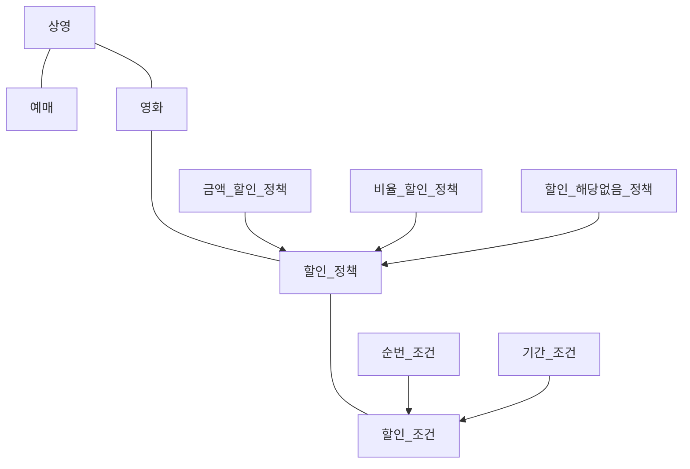
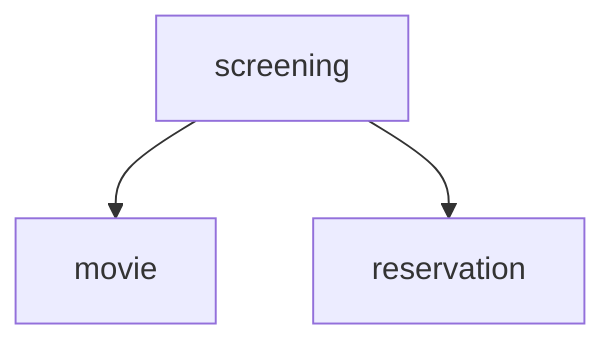
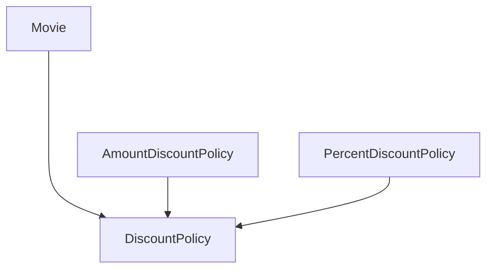

## [객사오 2장] 이상한 나라의 객체 & [오브젝트 2장] 객체지향 프로그래밍

### 협력, 객체, 클래스

---

프로그래밍 과정에서, 
1. 어떤 클래스가 필요한지를 고민하기 전에 `어떤 객체들이 필요한지 고민하라`.
2. `객체 != 독립적인 존재`, `객체 == 기능을 구현하기 위해 협력하는 공동체의 일원` <br> 
객체는 홀로 존재하는 것이 아니라, 다른 객체에게 도움을 주거나 의존하면서 살아가는 협력적인 존재다.

그 후에 클래스의 윤곽을 잡기 위해서는, 
- 어떤 객체들이 `어떤 상태, 어떤 행동`을 가지는지 고민해야 한다.
- 객체들의 윤곽이 잡히면, `공통된 특성과 상태를 가진 객체들을 타입으로 분류`하고 이 타입을 기반으로 `클래스를 구현`한다.

### 도메인의 구조를 따르는 프로그램 구조

---

**도메인(domain)**<br>
문제를 해결하기 위해 사용자가 프로그램을 사용하는 분야

**영화 예매 도메인**


- 클래스를 구현하거나 다른 개발자에 의해 개발된 클래스를 사용할 때 가장 중요한 것은 `클래스의 경계를 구분 짓는 것` 이다. 
  - 핵심은 어떤 부분을 외부에 공개하고 어떤 부분을 감출지를 결정하는 것이다.
- 클래스의 `외부, 내부를 구분해야하는 이유`는?
  - 경계의 명확성이 객체의 자율성을 보장한다. 더 중요한 이유는, **프로그래머에게 구현의 자유를 제공**한다.     
  
### 자율적인 객체

---

1. 객체는 **상태(state)** 와 **행동(behavior)** 을 가지는 복합적인 존재이다.
2. 객체가 스스로 판단하고 행동하는 **자율적인 존재** 라는 것이다.

**캡슐화**
- `데이터와 기능`을 `객체 내부로 함께 묶는 것`

**접근 제어(access control)** 메커니즘
- 캡슐화에서 더 나아가 `외부에서의 접근을 통제하는 것`
- 이를 위해 public, protected, private 과 같은 `접근 수정자(access modifier)`를 제공한다.

**객체 내부에 대한 접근을 통제하는 이유?**
- 객체를 자율적인 존재로 만들기 위함
- 스스로 상태를 관리하고, 판단하고, 행동하는 자율적인 객체들의 공동체를 구성하는 것
- 이를 위해 `외부의 간섭을 최소화` 해야 한다.<br>
  - 외부에서는 객체가 어떤 상태에 놓여 있는지, 어떤 생각을 하고 있는지 알아서는 안된다.
  - 결정에 직접적으로 개입하려고 해서도 안된다.
- 객체에게 `원하는 것을 요청`하고 객체 스스로 최선의 방법을 결정할 수 있을 것이라는 점을 `믿고 기다려야 한다`.


### 프로그래머의 자유

---

**클래스 작성자(class creator)** 와 **클라이언트 프로그래머(client programmer)** 로 구분하는 것은 유용하다.
- **클래스 작성자**
  - 새로운 데이터 타입을 프로그램에 추가한다.
  - 클라이언트 프로그래머에게 `필요한 부분만 공개하고 나머지는 꽁꽁 숨긴다`. 이는 클래스 프로그래머가 숨겨 놓은 
  부분에 마음대로 접근할 수 없게 하며 클라이언트 프로그래머에 대한 영향을 걱정하지 않고 `내부 구현을 마음대로 변경`할 수 있다.
    -> **구현 은닉(implementation hiding)**
- **클래스 프로그래머**
  - 클래스 작성자가 추가한 데이터 타입을 사용한다.
  - 필요한 클래스들을 엮어서 애플리케이션을 `빠르고 안정적으로 구축하는 것`이 목표이다.

**접근 제어 메커니즘**
- 클래스의 내부와 외부를 명확하게 구분 짓게 한다.
- 클래스 프로그래머가 `실수로 숨겨진 부분에 접근하는 것을 막아준다`. (접근 시 컴파일러 오류 발생)
- 클래스 작성자가 내부 구현을 은닉할 수 있다.
  - 클래스 프로그래머가 알아야할 지식이 줄어들고, 클래스 작성자는 `public 영역 제외하면 코드를 자유롭게 수정`할 수 있다.
  
> **변경을 관리**하기 위해서, 클래스 개발 시 **인터페이스와 구현을 깔끔하게 분리 (접근 제어)** 하기 위해 노력해야 한다. 

### 협력하는 객체들의 공통체

---

> 의미를 좀 더 명시적이고 분명하게 표현할 수 있다면 객체를 사용해서 해당 개념을 구현하라.
- **Long 타입**: 변수의 크기나 연산자의 종류와 관련된 구현 관점의 제약은 표현 가능
- **Money 타입**: 저장하는 `값이 금액과 관련돼 있다는 의미` 전달 가능

**협력 (Collaboration)** <br>
시스템의 어떤 기능을 구현하기 위해 `객체들 사이에 이뤄지는 상호작용`

```java
public class Reservation {
    private Customer customer;
    private Screening screening;
    private Money fee;
    private int audienceCount;
    
    public Reservation(Customer customer, Screening screening, Money fee, int audienceCount) {
        this.customer = customer;
        this.screening = screening;
        this.fee = fee;
        this.audienceCount = audienceCount;
    }
}
```



- Screening이 Movie의 calculateMovieFee() ~~메서드를 호출한다~~ -> `메시지를 전송한다.` <br> 

  - Screening은 Movie 안에 `해당 메서드가 존재하는지조차 알지 못한다`. 메시지에 응답할 수 있다고 `믿고 메시지를 전송`할 뿐이다.
  - `메시지를 처리하는 방법은 Movie 스스로의 문제`이다.
  - 객체가 메시지를 처리하는 `방법을 자율적으로 결정`한다.

  
### 상속과 다형성

---



- 코드 수준에서 `Movie 클래스`는 AmountDiscountPolicy 나 PercentDiscountPolicy 를 의존하지 않고, 
`오직 추상 클래스인 DiscountPolicy` 에만 의존`한다.
- 그러나 `Movie 클래스`와 `AmountDiscountPolicy, PercentDiscountPolicy 의 인스턴스`와 **실행 시점에 협력 가능한 이유**는?
  - Movie 인스턴스 생성 시 인자로 AmountDiscountPolicy 인스턴스를 전달함으로써, `실행 시`에 Movie 인스턴스는 AmountDiscountPolicy 클래스의 인스턴스에 `의존`하게 된다.

```java
Movie avatar = new Movie("아바타",
        Duration.ofMinutes(120),
        Money.wons(10000),
        new AmountDiscountPolicy(Money.wons(800),
                new SequenceCondition(1),
                new SequenceCondition(10),
                new PeriodCondition(DayOfWeek.MONDAY, LocalTime.of(10, 0), LocalTime.of(11, 59)),
                new PeriodCondition(DayOfWeek.THURSDAY, LocalTime.of(10, 0), LocalTime.of(20, 59))));
```

**의존성의 양면성**

- `코드의 의존성 != 실행 시점의 의존성`
- `클래스 사이의 의존성 != 객체 사이의 의존성` 이 가능하다.

- **장점**:
  - 유연하고, 쉽게 재사용할 수 있으며, 확장 가능해진다.
    - 원하는 인스턴스를 전달하면 되기 때문

- **단점**:
  - 설계가 유연할 수록 코드를 이해하고 디버깅하기가 점점 더 어려워진다.
    - ex. 코드 상에서, Movie 클래스에 AmountDiscountPolicy나 PercentDiscountPolicy 에 의존하는 곳이 없기 때문

### 상속과 인터페이스

---

**인터페이스**
- `객체가 이해할 수 있는 메시지의 목록을 정의`하는 것
- 상속을 통해 자식 클래스는 자신의 인터페이스에 부모 클래스의 인터페이스를 포함하게 된다.
- `자식 클래스는 부모 클래스가 수신할 수 있는 모든 메시지를 수신`할 수 있기 때문에, 외부 객체는 `자식 클래스를 부모 클래스와 동일한 타입`으로 간주할 수 있다.
  - 즉, `Movie 클래스`는 calculateDiscountAmount 라는 `메시지를 이해할 수만 있다면 어떤 클래스의 인스턴스인지는 상관하지 않는다`는 것이다.
- 컴파일러는 코드 상에서 부모 클래스가 나오는 모든 장소에서 자식 클래스를 사용하는 것을 허용한다.

**업캐스팅 (upcasting)**
- `자식 클래스가 부모 클래스를 대신하는 것`
  - Movie 생성자의 인자 타입이 DiscountPolicy(부모 클래스)임에도, AmountDiscountPolicy와 PercentDiscountPolicy의 인스턴스가 전달할 수 있다.

### 다형성

---

**메시지 != 메서드**

- 코드 상에서 Movie 클래스는 DiscountPolicy 클래스에게 메시지를 전송하지만, <br> 
`실행 시점에 실제로 실행되는 메서드`는 Movie와 협력하는 객체의 `실제 클래스가 무엇인지에 따라 달라진다`.

> 즉, Movie 는 **동일한 메시지를 전송**하지만 실제로 어떤 메서드가 실행될 것인지는 **메시지를 수신하는 객체의 클래스가 무엇이냐에 따라 달라진다**. <br> 

**다형성**

- 기반
  - **컴파일 시간 의존성** != **실행 시간 의존성** 특성
- 정의
  - `동일한 메시지를 수신했을 때 객체의 타입에 따라 다르게 응답할 수 있는 능력`
    <br><br>
- 다형적인 협력에 참여하는 객체들은 인터페이스가 동일해야 한다. (-> 모두 같은 메시지를 이해할 수 있어야 한다.)
  - AmountDiscountPolicy와 PercentDiscountPolicy 는 DiscountPolicy 로부터 동일한 인터페이스를 물려받았다.
  - 이 두 클래스의 인터페이스를 통일하기 위해 사용한 방식이 `상속` 이다.
<br><br>
- 다형성을 구현하는 방법은 상속 외에도 여러 방식이 있다.
- 그러나 공통점은 메시지에 응답하기 위해 `실행될 메서드를 컴파일 시점이 아닌 실행 시점에 결정한다.`
- 즉, **메시지와 메서드를 실행 시점에 바인딩한다**는 것 -> `지연 바인딩(lazy binding) 또는 동적 바인딩(dynamic binding)`
  - <-> 초기 바인딩(early binding) 또는 정적 바인딩(static binding)
    - 컴파일 시점에 실행될 함수나 프로시저를 결정하는 것, 전통적이 경우
<br><br>
- `지연 바인딩(lazy binding)` 메커니즘
  - 다형성의 기반과, 정의가 가능할 수 있는 이유

**구현 상속과 인터페이스 상속**

- 구현 상속 (implementation inheritance, subclassing)
  - 순수하게 코드를 재사용하기 위한 목적으로 상속하는 것
- 인터페이스 상속 (interface inheritance, subtyping)
  - 다형적인 협력을 위해 부모 클래스와 자식 클래스가 인터페이스를 공유하기 위해 이용하는 것

=> 상속은 구현 상속이 아니라 `인터페이스 상속`을 위해 사용해야 한다. 구현 상속은 변경에 취약한 코드를 낳게 될 확률이 높다.

### 인터페이스와 다형성

---

- 인터페이스를 활용하여 구현은 공유할 필요 없고, 순수하게 인터페이스만 공유할 수 있다.
- `동일한 인터페이스를 공유하여 다형적인 협력에 참여할 수 있다.`

### 추상화의 힘

---

- 세부적인 내용을 무시한 채 상위 정책을 쉽고 간단하게 표현할 수 있다.
- 추상화를 이용해 상위 정책을 기술한다는 것은 기본적인 애플리케이션의 협력 흐름을 기술한다는 것을 의미한다.
  - ex. Movie -> DiscountPolicy(추상화) -> DiscountCondition(추상화) 라는 상위의 협력 흐름을 정의했을 때, <br> 
  할인 정책이나 할인 조건의 `새로운 자식 클래스들은 추상화를 이용해 정의한 상위의 협력 흐름을 그대로 따르게 된다`. <br> 
  -> **디자인 패턴(design pattern)** 이나 **프레임워크(framework)** 모두 추상화 기반 상위 정책을 정의하는 객체지향의 메커니즘을 활용한다. 

### 코드 재사용

---

**상속**
- 가장 큰 문제는, `캡슐화를 위반`한다.
  - 부모 클래스의 구현이 자식 클래스에게 노출된다.
  - 부모 클래스 변경 시, 자식 클래스 변경 확률이 크다.
- 설계가 유연하지 않다.
  - 상속은 부모 클래스와 자식 클래스의 관계를 컴파일 시점에 결정한다.
  - 따라서 실행 시점에 객체의 종류를 변경하는 것이 불가능하다.

**합성**
- 인터페이스를 통해 약하게 결합된다.
  - ex. Movie, DiscountPolicy
- 인터페이스에 정의된 메시지를 통해서만 코드를 재사용하는 방법
  - 효과적으로 캡슐화 가능
  - 의존하는 인터페이스 교체가 비교적 쉬워 유연한 설계 가능
  - 코드 재사용을 위해서는 상속보다 합성이 더 좋은 방법

> '절대 상속을 사용을 하지말자'가 아니라, **코드 재사용을 위해서는 합성**을 선호하되, <br>
**다형성을 위해 인터페이스를 재사용하는 경우에는 상속과 합성을 함께 조합해서 사용**할 것!
